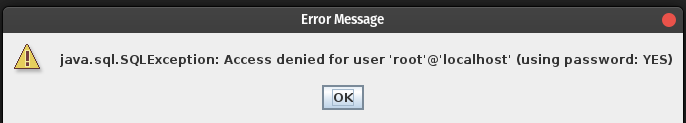

# masonSQL Viewer

**Description**: This is a lightweight Java program meant to show the user the basic structure of a MySQL database.

**Note**: the ``` mysql-connector-java-8.0.21.jar ``` file must be in the same location as the masonSQL.jar file.


### Usage

Run the ``` masonSQL.jar ``` file:

#### Windows:4

	You should be able to double click the file if Java is installed properly.

#### macOS & Linux:

	 ``` java -jar masonSQL.jar ```

	 **Note**: You have to make sure it is executable.  If it doesn't work try:
	 ``` chmod +x masonSQL.jar ```

You should then be able to type in your database name and password for mySQL.  This program assumes that ```root``` is the default username for mySQL.

If done Correctly the program should open a new window with a file like structure to view the Database contents.

**Note**: This program has only been tested on linux as of right now (I will remove this once it has been tested on all 3 Operating Systems).

### Common Errors:

You will most likely recieve 2 kinds of errors if something is done improperly. 

#### First Error:
	``` 
	JDBC Driver Not Found!
	Exiting. 
	```
	
This means you don't have the proper driver in the same folder as the masonSQL.jar file.
As stated above, the ``` mysql-connector-java-8.0.21.jar ``` must be in the same folder as masonSQL.jar file.


#### Second Error:

	

This means you typed in your password incorrectly.
It could also mean that ``` root ``` is not your mySQL username. 

### Other Inquiries

I am open to suggestions.  If something doesn't work or could use improvement feel free to give input.

